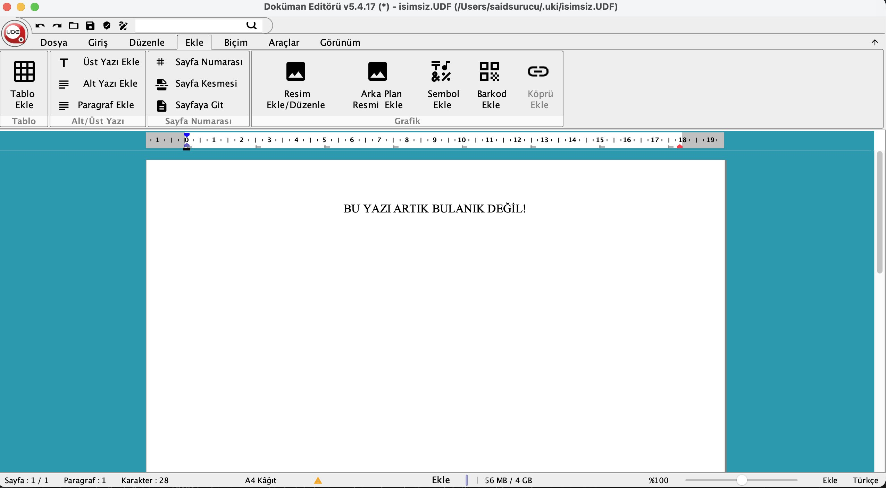

# UDE — Apple Silicon (arm64) Native

[Uyap Doküman Editörü](https://uyap.gov.tr)'nü (UDE) Apple Silicon (M1/M2/M3/M4)
Mac'lerde **Rosetta olmadan** native çalıştırır. Rosetta çeviri katmanı olmadığı için
**daha hızlı** açılır ve çalışır. Java gömülü gelir; ayrıca bir şey kurmaya gerek yoktur
ve `.udf` dosyalarına **çift tıklayarak** açabilirsiniz.



> Modern Material ikonlar + Java 11 HiDPI ile **Retina'da keskin** metin ve arayüz.

> ⚠️ **Bu depo UYAP Doküman Editörü'nün kaynak kodunu içermez.** Tamamen bağımsız,
> **gayriresmî** bir Mac **yamasıdır**: hiçbir kamu kurumu tarafından
> geliştirilmemiş/onaylanmamıştır. Burada bulunan yalnızca yama ve build betikleridir;
> resmî UDE paketi build sırasında uyap.gov.tr'den **siz** indirir ve yamayı uygulamanın
> üstüne **siz** çalıştırırsınız. "Olduğu gibi" sunulur.

> ✅ **E-imza çalışıyor:** Akıllı kart okuyucu algılaması (`5.4.17_4`+) çözüldü —
> gömülü Java artık PCSC üzerinden kartı görüyor ve imzalama akışı baştan sona
> çalışıyor. Belge açma/düzenleme de sorunsuz.

> 📦 **Hazır (paketlenmiş) uygulama dağıtılmaz.** İşgüzarlarla uğraşmak istemediğim
> için paketlenmiş hâlini dağıtmıyorum; uygulamayı **kendiniz derleyip paketlersiniz**.
> Bu sayfada bir "Releases" / hazır indirme bağlantısı **bulmazsınız**. Aşağıdaki adımlar
> derlemeyi olabildiğince kolaylaştırır — komutları kopyala-yapıştır ile çalıştırmanız yeterli.

---

# 👩‍⚖️ Kolay kurulum — kendiniz derleyin

Programcı olmanıza gerek yok; aşağıdaki komutları sırayla **kopyalayıp yapıştırmanız**
yeterli. Java vb. ayrıca kurmanıza gerek yoktur — gereken Java sürümleri build sırasında
**otomatik** indirilir.

### 1) Geliştirici araçlarını kurun (bir kez)

**Terminal** uygulamasını açın: klavyede `Command (⌘) + Boşluk`'a basın, açılan kutuya
**Terminal** yazıp **Enter**'a basın. Sonra şu satırı yapıştırıp **Enter**'a basın:

```bash
xcode-select --install
```

Bir pencere açılırsa **"Yükle"**ye basıp bitmesini bekleyin. (Zaten kuruluysa "already
installed" der; sorun değil.)

### 2) Kaynak kodu indirin

İki yol var; **A yolu** en kolayıdır (tıkla-indir).

**A) ZIP olarak indirin (önerilir)**

1. Bu sayfanın sağ üstündeki yeşil **`< > Code`** düğmesine tıklayın.
2. Açılan menünün en altındaki **"Download ZIP"**e tıklayın. Dosya **İndirilenler**
   (Downloads) klasörünüze iner (`ude-mac-arm64-main.zip`).
3. İnen ZIP dosyasına **çift tıklayın**; yanında `ude-mac-arm64-main` adında bir klasör
   açılır.

Sonra **Terminal**'i açıp (`⌘ + Boşluk` → `Terminal` → Enter) şu satırı yapıştırın ve
**Enter**'a basın — bu, az önce açılan klasörün içine girer:

```bash
cd ~/Downloads/ude-mac-arm64-main
```

**B) Tek komutla indirin (Terminal'i biliyorsanız)**

```bash
git clone https://github.com/saidsurucu/ude-mac-arm64.git
cd ude-mac-arm64
```

### 3) Derleyin

Klasöre girdikten sonra (yukarıdaki `cd …` adımı) aşağıdaki bloğun **tamamını**
kopyalayıp Terminal'e yapıştırın, **Enter**'a basın:

```bash
make jdk           # gömülecek arm64 Java 11'i otomatik indirir
make jpackage-jdk  # paketleyici JDK'yı otomatik indirir
ICONS=1 make all   # uygulamayı derler + modern ikonlarla paketler + imzalar
```

İlk derleme internet hızınıza göre birkaç dakika sürebilir. Bittiğinde uygulama
`build/Uyap Doküman Editörü.app` olarak hazırdır.

### 4) Uygulamayı Applications'a taşıyın

```bash
mv "build/Uyap Doküman Editörü.app" /Applications/
```

Artık **Launchpad** veya **Applications** klasöründen çift tıklayarak açabilir, `.udf`
dosyalarına da çift tıklayıp açabilirsiniz. (Kendiniz derleyip imzaladığınız için macOS
"geliştirici doğrulanamadı" uyarısı **çıkmaz**; `xattr` ile uğraşmanıza gerek yoktur.)

**Yeni Editör sürümü çıktığında 2. adımdan itibaren adımları tekrarlamanız yeterli. En güncel sürüm otomatik inecek ve yamalanacak.**

### E-imza kullanacaksanız — AKİS sürücüsü (zorunlu)

Akıllı kart / e-imza sürücünüzün de Apple Silicon (arm64) sürümünün kurulu olması gerekir.

1. TÜBİTAK BİLGEM AKİS — Destek/İndirme sayfasından
   (<https://akiskart.bilgem.tubitak.gov.tr/destek/>) **"Mac OS Arm (Apple Silicon)"**
   başlığı altındaki güncel paketi indirin (ör. `Akia_macos_arm_6_8_9.pkg`).
   **"Mac OS Intel"** paketini değil, **Arm** paketini seçin.
2. İndirilen `.pkg`'a çift tıklayıp kurulumu tamamlayın (yönetici şifresi ister).

---

# 🛠️ Mühendisler için — Teknik ayrıntı

Yukarıdaki adımlar derlemek için yeterlidir. Bu bölüm, dönüşümün **neyi nasıl** çözdüğünü
ve tek tek build hedeflerini açıklar.

## Neyi nasıl çözüyor

Resmî paket x86_64. Native arm64 için:

1. **Launcher** → `jpackage` ile arm64 **Java 11** runtime **gömülü**, gerçek native
   launcher üretilir. Kullanıcı Java kurmaz; macOS çift-tık (dosya açma) çalışır.
2. **Retina/keskin metin** → arm64 **Java 8** Swing'i Retina'da bulanık render ediyordu.
   **Java 11** (JEP 263 otomatik HiDPI) ile metin keskin. UDE'nin Java 8 bytecode'u
   Java 11'de çalışır (WebLaF illegal-access uyarıyla geçer).
3. **eawt-shim** → UDE'nin kullandığı eski `com.apple.eawt` API'si Java 11'de kaldırılmış.
   `scripts/eawt-shim` ile bu sınıflar `--patch-module java.desktop` üzerinden sağlanır;
   dosya açma, Java 11'in native dispatcher'ına reflection ile köprülenir → çift-tık korunur.
4. **sqlite-jdbc 3.7.2** (arm64 native'i yok) → **3.46.x** ile değiştirilir.
5. **JNA** → uygulama JNA'yı hiç çağırmıyor (bytecode taramasıyla doğrulandı), dokunulmaz.
6. **Modern ikonlar** (`ICONS=1`) → UDE'nin ~324 toolbar/aksiyon ikonu modern **Material**
   setiyle değiştirilir ve **Retina-keskin** yapılır. UDE ikonları düz `ImageIcon` olarak
   yüklenip HiDPI-farkında olmadığından, yükleyici (`Utils.b`) Javassist ile
   `BaseMultiResolutionImage`'a (1x + `@2x`) köprülenir. Override görseller
   `scripts/icons/overrides`, yama `scripts/icons/IconLoaderPatch.java`. Yayınlanan
   sürümler bu modu açık derlenir.

7. **E-imza** (`5.4.17_4`+) → JDK'nın `javax.smartcardio` + `sun.security.pkcs11`
   API'leriyle çalışır (JNA değil). Gömülü Java'nın `javax.smartcardio` katmanı macOS'ta
   PCSC native kütüphanesini varsayılan yolda bulamadığından kart okuyucu görünmüyordu.
   Çözüm `-Dsun.security.smartcardio.library=/System/Library/Frameworks/PCSC.framework/Versions/A/PCSC`
   ile bu yolu vermek; ancak `jpackage`'ın `.cfg` java-option'ları çift-tıkla açılan
   launcher'da bu JVM'e ulaşmıyordu (kullanıcı `lsof` ile doğruladı: framework yüklenmiyordu).
   Bu yüzden parametre, JVM'in her zaman okuduğu `JAVA_TOOL_OPTIONS` ortam değişkenine,
   `.app`'in `Info.plist`'indeki `LSEnvironment` (Launch Services) anahtarıyla gömülür →
   çift-tık açılışta garanti uygulanır. (`Versions/Current` symlink yerine kanıtlanmış
   `Versions/A` yolu kullanılır.)

8. **Trackpad ile yakınlaştırma** → UDE'de zoom yalnızca durum çubuğundaki kaydırıcıyla
   yapılabiliyordu; trackpad jesti yoktu. `scripts/macos-zoom` javaagent'ı **⌘ + iki parmak
   kaydırma** jestini bu kaydırıcıya bağlar: Cmd basılıyken gelen `MouseWheelEvent` yakalanıp
   yutulur (belge kaymaz) ve uygulamanın zoom kaydırıcısı sürülür → belge büyür/küçülür.
   Gerçek iki-parmak *pinch* jesti modern Java'ya iletilmediğinden ⌘ tuşu gerekir; ⌘'süz
   kaydırma belgeyi normal kaydırır. Olayı yutabilmek için sistem `EventQueue`'su **ilk odak
   olayında** devralınır (premain'de erken devralma WebLaF tarafından baypas edilir).
   Ayrıca **`⌘+` / `⌘−`** klavye kısayolları da aynı kaydırıcıyı sürer (bir `KeyEventDispatcher`
   ile); macOS'un standart yakınlaştır/uzaklaştır tuşları beklendiği gibi çalışır.

9. **Standart Mac kısayolları** → UDE'nin editörü Windows kökenli; kısayollar Ctrl tabanlı ve
   bir kısmı alışılmadık tuşlarda (kalın `Ctrl+K`, italik `Ctrl+T`, altı çizili `Ctrl+Shift+A`,
   bul `Ctrl+B`). Üstelik macOS, metin bileşenlerine yerleşik **Emacs imleç bağlamaları** ekler
   (`Ctrl+A` satır başı, `Ctrl+B` harf geri, `Ctrl+N/P/O/F`, `Ctrl+V` sayfa aşağı…) ve bunlar
   uygulamanın komutlarından önce çalışır → sentetik bir `Ctrl+A` "tümünü seç" değil "satır başı"
   yapar. `scripts/macos-textkeys`'teki `MacShortcutRemap` (bir `KeyEventDispatcher`) bu yüzden
   üç katmanlı çalışır:
   - **Menü-etiketi**: Menüde karşılığı olan komutlar için odaktaki pencerenin menü ağacında
     etiketle eşleşen etkin `JMenuItem` bulunup `doClick()` edilir. Bu, uygulamanın **gerçek**
     eylemini (zengin-metin yapıştırma vb.) çağırır ve odak bileşenini kullanmadığından Emacs
     gölgesini tamamen baypas eder. (Menü öğelerinin hızlandırıcısı yoktur; eşleme etiketledir.)
   - **Metin API'si**: Seç/kopyala/kes/yapıştır için yedek olarak doğrudan `JTextComponent`.
   - **Sentetik Ctrl**: Menüde olmayan biçimlendirme (kalın/italik/altı çizili) için odaktaki
     bileşene sentetik Ctrl gönderilir (uygulama bu tuşları Emacs'in üzerine ezdiğinden çalışır).

   Eşlemeler: `⌘B/⌘I/⌘U`→kalın/italik/altı çizili, `⌘C/⌘V/⌘X/⌘A`→kopyala/yapıştır/kes/tümünü seç,
   `⌘Z/⌘⇧Z`→geri/ileri al, `⌘N/⌘O/⌘S/⌘⇧S`→yeni/aç/kaydet/farklı kaydet, `⌘P/⌘⇧P`→yazdır/önizleme,
   `⌘F`→bul, `⌘T`→yazı özellikleri. Mevcut Ctrl kısayolları aynen çalışır; `⌘Q/⌘W/⌘H/⌘M` gibi
   gerçek macOS kısayollarına dokunulmaz.

> Not: macOS codesign, `.app` adındaki Türkçe karakterlerle imzayı bozuyor; bu yüzden
> executable ASCII (`UyapDokumanEditoru`) tutulur, görünen ad sonradan Türkçe yapılır.

## Gereksinimler (yalnızca build için)

- Apple Silicon Mac
- **arm64 Java 11** (gömülecek runtime) — yoksa `make jdk` Azul Zulu 11'i kurar
- **jpackage'lı 17+ JDK** (jpackage + shim derlemesi) — yoksa `make jpackage-jdk` Azul Zulu 21'i kurar
- `curl`, `unzip`, `zip`, `codesign`, `plutil` (macOS'ta hazır gelir)

## Kullanım

```bash
make jdk           # gömülecek arm64 Java 11 yoksa kur
make jpackage-jdk  # jpackage'lı 17+ JDK yoksa kur
make all           # build/Uyap Doküman Editörü.app üret
ICONS=1 make all   # + modern Material/Retina ikonlar (yayın sürümleri böyle)
```

### Diğer hedefler

```
make help        # tüm hedefler
make check-deps  # araç + arm64 Java 11 + jpackage denetimi
make download    # paketi indir + kaynağı aç
make deps        # sqlite-jdbc indir + arm64 dylib doğrula
make shim        # eawt-shim derle (Java 11 com.apple.eawt yerine)
make patch       # editor-app.jar yamala (sqlite swap + eawt çıkar)
make package     # jpackage ile .app üret (Java 11 + shim, .udf ilişkilendirmeli)
make sign        # ad-hoc codesign
make clean / distclean
```

### Yeni UDE sürümü çıkınca

```bash
make distclean
UDE_URL="https://rayp.adalet.gov.tr/.../yeni-paket.zip" make all
```

> Uyarı: İleride paket yapısı (jar/sqlite sürümü) değişirse betiklerin güncellenmesi gerekebilir.

## CI build (isteğe bağlı)

`.github/workflows/release.yml` (elle tetiklenir): macOS arm64 runner'da `make all`
çalıştırır ve `.app`'i imzayı bozmadan zip'ler. Sürüm, UDE sürümünden türetilir:
`<ude_surumu>_<N>` (ör. `5.4.17_1`). Bu yalnızca derlemenin doğrulanması/kişisel kullanım
içindir; bu depo **hazır paket dağıtmaz** (bkz. en üstteki not).

---

## Teşekkür

Bu çalışmaya ilham veren ve sorunun çözüm yolunu ortaya koyan
[**tosbaha**](https://github.com/tosbaha) kullanıcısına ([tosbaha/uyap-arm](https://github.com/tosbaha/uyap-arm))
teşekkürler.
