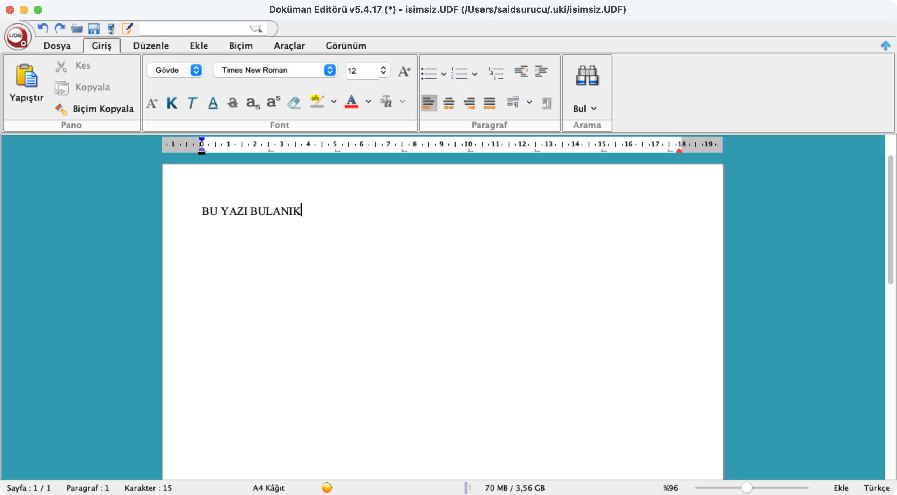
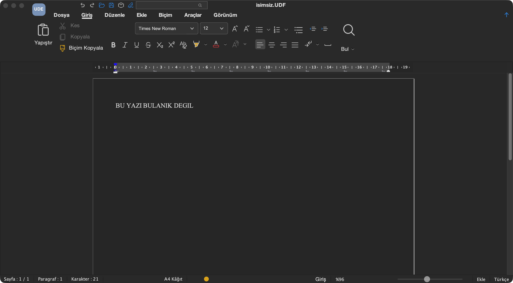

# Rebuilding the app a quarter-million people are forced to use

**What this is, in three sentences.** Turkey runs its entire justice system on one closed-source, government-mandated editor and its proprietary `.udf` format — and on Apple Silicon Macs it was barely usable. I rebuilt it from the outside: reverse-engineering the obfuscated binary with Claude Code as a debugging partner, and shipping twenty fixes — from a native Apple-Silicon runtime to a full dark mode. No source code, no vendor cooperation, no replacing the format you're legally required to use.

## 1. The problem

In Turkey you cannot file anything with the courts except through **UYAP**, the Ministry of Justice's digital backbone, in its proprietary **UDF** format — a signed zip that nothing else opens. The only official tool is the **UYAP Document Editor**, an aging Java desktop app. The captive audience is enormous and has no exit: **206,678 lawyers**, ~**25,000 judges and prosecutors**, tens of thousands of courthouse clerks and court-appointed expert witnesses, plus millions of citizens. Nobody chose this format, and nobody can opt out of it.

## 2. What people actually live with

On a modern Mac, the official build limps along under Rosetta translation — slow to open, sluggish to use, text rendered soft and blurry, ⌘-shortcuts dead, Turkish letters (`ğ ş ı İ`) silently dropped from exported PDFs, and dictation that deletes your paragraph and freezes the app. So people improvise: forum threads full of lawyers who "struggled for weeks" or were "about to switch to Windows"; the official iOS companion sitting at 2.0★; an entire folklore of reinstalling Intel Java, deleting hidden config files, exporting to PDF just to print, or paying for web converters. Many simply keep a second Windows machine around to do the one thing their government requires.

*Same document, same Retina screen — the official build versus this rebuild (sharp, native, dark). It follows the system appearance, so light mode looks just as clean.*

## 3. What I did with Claude Code

The editor is closed and **obfuscated** — no source, classes named `aF` and `hj` — so everything happened from the outside: build-time bytecode patches and runtime Java agents. The work was a human-plus-AI loop: I formed the hypotheses and kept the judgment (helped by having already reverse-engineered the format once myself, in my open-source [**UDF-Toolkit**](https://github.com/saidsurucu/UDF-Toolkit)), while Claude Code read the mountains of disassembly and pixel measurements and proposed the next falsifiable test. The result is **twenty fixes**: a native arm64 Java 11 runtime (no Rosetta), razor-sharp Retina text, working Mac shortcuts, smart-card e-signature, correct Turkish PDFs, a dictation fix, rich paste from Word and Pages, mouse image-resize, and a flat Word-2026 look with real dark mode. Work that used to need a specialist and a clear month — which usually meant it never got done at all.

## 4. What comes next

Clunky, mandated technologies like this used to be effectively untouchable: the people who felt the pain and the people who could fix it were never the same people. That gap just collapsed — and software that doesn't serve the humans forced to use it will now be rebuilt, or routed around, far faster than the institutions shipping it can keep up.

---

> Independent, unofficial macOS patch — not endorsed by any public institution; the user downloads the official package and patches it locally. Full write-up with all sources: [blog-post.md](blog-post.md).
