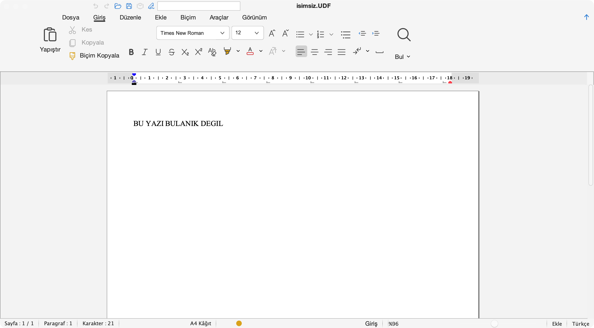

# Patching the mandatory app that 200,000 lawyers can't escape

*How a closed-source, obfuscated Java application that every Turkish lawyer is forced to use got a second life on the Mac — reverse-engineered one bytecode patch at a time, with Claude Code as a debugging partner.*

---

## The thing nobody outside Turkey has heard of, that everyone inside Turkey has to use

If you practice law in Turkey, you don't get to choose your word processor.

Every petition, every motion, every piece of evidence, every court filing flows through a single government system called **UYAP** — the *Ulusal Yargı Ağı Projesi* (National Judiciary Informatics System), the Ministry of Justice's digital backbone for the entire court apparatus: the Court of Cassation, the Council of State, criminal and civil courts of first instance, heavy penal courts, family, labor, commercial and administrative courts, public prosecutors, enforcement and bankruptcy offices, and notaries. ([uyap.gov.tr](https://uyap.gov.tr/Genel-Bilgi), [Wikipedia](https://tr.wikipedia.org/wiki/UYAP))

And UYAP doesn't speak PDF, or `.docx`, or anything you've heard of. It speaks **UDF** — *UYAP Doküman Formatı* — a proprietary document format designed so that legal documents carry an embedded electronic-signature integrity guarantee. A `.udf` file is really a zip containing the document's XML plus a detached CAdES-BES signature. You cannot legally file a document unless it's a properly structured, properly signed `.udf`.

To create, edit and sign those files there is exactly one official tool: the **UYAP Doküman Editörü** (UYAP Document Editor, "UDE") — a free Java desktop application distributed by the Ministry of Justice. It is the only sanctioned way in.

And here's the thing: this isn't a tool for lawyers. It's a tool for *everyone who works with the courts*. Consider the scale of the captive audience:

- **206,678 registered lawyers** in Turkey as of 31 December 2025 — the İstanbul Bar alone holds 67,463 members, Ankara 26,206 and İzmir 14,300 ([Hukuki Haber](https://www.hukukihaber.net/turkiyede-206-bin-678-avukat-var-istanbul-barosuna-kayitli-avukat-sayisi-ise-67-bin-463)). That's up from **199,142** a year earlier ([Türkiye Barolar Birliği](https://www.barobirlik.org.tr/Haberler/2024-avukat-sayilari-31122024-85333)) and 185,749 at the end of 2023 — roughly **44% growth in five years**.
- Roughly **25,000 judges and public prosecutors** (24,978 as of 2024), who draft and sign their decisions and indictments in the same format. ([Gazete Memur](https://gazetememur.com/gundem/hakim-savci-sayisi-artti-yargilamalar-kisaldi,Ucp5Ty-BxkGt4XqwwM3BZQ))
- **Tens of thousands of courthouse staff** — court clerks (*zabıt kâtibi*), enforcement-office clerks, registrars — inside a Ministry of Justice workforce that the ministry is scaling toward **238,634 people** by 2028. ([source](https://x.com/tayfn_ky/status/1935203474729484770))
- **Tens of thousands of court-appointed expert witnesses** (*bilirkişi*) who file their reports through their own dedicated [UYAP Bilirkişi Portal](https://bilirkisi.uyap.gov.tr/) — plus notaries, and millions of ordinary citizens who at least open a `.udf` to follow their own case.

Add it up and you're comfortably past **a quarter of a million working professionals** for whom UDF isn't a niche file type — it is the daily substrate of their work. Nobody in that group chose it, and none of them can opt out.

And here is the problem.

## The captive tool is also a broken one — especially on a Mac

The official editor is an aging Java/Swing application built, by all appearances, for Windows. On Apple Silicon Macs — the M1/M2/M3/M4 machines that a huge number of younger lawyers now buy as their only computer — it ranges from "ugly" to "won't start."

You don't have to take my word for it. The official iOS companion app carries a **2.0-out-of-5 rating** on the App Store (as of mid-2026), with reviews complaining that the "editor" is really just a viewer, that the UI is weak, and that downloaded `.udf` files sometimes crash the app on open. ([App Store](https://apps.apple.com/us/app/uyap-dok%C3%BCman-edit%C3%B6r/id1481849944)) The desktop story on Mac is worse, and the public record of it is a long trail of forum posts and lawyers' own blog tutorials:

- *"Unable to load Java Runtime Environment"* — the canonical Apple Silicon failure, caused by a mismatch between the Mac's CPU and the Java version the editor needs. Lawyers describe it in the comments: *"I struggled for weeks, just when I'd lost all hope…"*, *"I've been at this for hours,"* *"I was about to switch to Windows."* ([Av. Tolunay Akay](https://tolunayakay.av.tr/macos-uyap-dokuman-editoru-java-hatasi-nasil-cozulur/))
- **Printing simply doesn't work** on M1/M2/M4 MacBooks: the printer shows up in the dialog, but documents never reach the queue. One M2 user: *"same problem, searched everywhere, no current solution."* An M4 user: *"reinstalled Java multiple times, no luck."* The workaround people settle for is "export to PDF and print that," which one user flatly calls *"tedious."* ([DonanımHaber Forum](https://forum.donanimhaber.com/macbook-uyap-dokuman-editor-yazdirma-sorunu--157425223), [Pardus Forum](https://forum.pardus.org.tr/t/macte-uyap-dokuman-editoru-yazdirma-sorunu/24341))
- The standard "fix" circulated among lawyers is a small ritual of despair: install Rosetta 2, hunt down an *Intel* build of Java, delete hidden config files in `~/.uki`, reinstall, pray. ([Hürriyet](https://www.hurriyet.com.tr/bilgi/uyap-lisans-kontrolu-basarisiz-ve-dokuman-editoru-sorunu-cozumu-42208471))

Even when it does launch, the experience is rough: blurry, non-Retina text; Windows-style keyboard shortcuts that fight macOS's built-in editing keys; a 1990s file picker instead of the native Finder dialog; Turkish characters (`ğ ş ı İ`) silently dropped when you export to PDF; macOS dictation that loses your text and freezes the app; rich text pasted from Word or a browser flattened to plain text.

This is the "bleeding wound" the project set out to close. Not a hobby annoyance — a tool that a profession is *legally required* to use, that actively fights its users on the hardware they actually own.

## The hard part: there is no source code

Here's what makes this a genuinely interesting engineering story rather than a "submit a patch upstream" story.

**The editor is closed-source.** The repository behind this work contains *none* of the editor's code — it can't. What ships is `editor-app.jar`: a compiled, **obfuscated** Java archive. Classes are named `aF`, `gZ`, `hj`; methods are single letters; a class named `b` sits next to a class named `B` (which, on a case-insensitive Mac filesystem, will happily overwrite each other if you're careless). There is no documentation, no symbol map, no upstream to file an issue with. The Ministry isn't going to merge your PR.

So the only viable approach is **reverse engineering plus surgical bytecode patching**, layered on top of a binary you download fresh from `uyap.gov.tr` at build time and never redistribute. Two mechanisms do all the work:

1. **Build-time Javassist patches** — rewriting methods inside the obfuscated `.jar` directly. Want the PDF exporter to embed a Turkish-capable font? Find the method (by behavior, not name), inject a `setUserConfig` call. Want the icon loader to produce Retina-sharp images? Bridge it to a `BaseMultiResolutionImage`.
2. **Runtime Java agents** (`-javaagent`) — code that attaches to the running JVM and locates components by *walking the live component tree and matching on type*, because matching on name is impossible when every name is a single scrambled letter.

That's the toolkit. The interesting part is what it took to *aim* it.

## Where the human-plus-AI loop earned its keep

Reverse-engineering an obfuscated binary isn't a task you hand to a machine and walk away from. It's a loop: a human forms a hunch about which scrambled method does what and decides what would prove or disprove it; the assistant reads the wall of low-signal evidence that hunch generates — disassembly, component-tree dumps, pixel measurements — far faster than a person can, and proposes the next falsifiable test. The human keeps the intent and the judgment; Claude Code carries the volume and the memory of the last twenty dead ends. That's the division of labor that made the rest of this possible.

To see why that was worth doing, picture the user at the sharp end: a lawyer racing a midnight filing deadline, on a brand-new MacBook, when the government's *mandatory* editor decides to run at a crawl, blur every line of text, ignore ⌘-anything, drop the Turkish letters out of the client's name, swallow a dictated paragraph, and then fail to see the signature card. Every one of those was real. Here are the six that hurt the most — and what it took to kill each.

**1. It only ran under Rosetta — and Rosetta is on a countdown.** The official package is an Intel (x86_64) build, so on an Apple-Silicon Mac it runs through Rosetta 2 translation: slow to launch, sluggish in use. And this isn't a problem that ages gracefully — it's a deadline. Apple announced at WWDC 2025 that Rosetta 2 stays only through macOS 27; macOS 26.4 already pops a warning on Intel-only apps that they'll stop working, macOS 27 "Golden Gate" (fall 2026) is the *last* release with full Rosetta, and macOS 28 (2027) removes it for everything but a few old games. ([MacRumors](https://www.macrumors.com/2025/06/10/apple-to-phase-out-rosetta-2/), [9to5Mac](https://9to5mac.com/2026/02/16/macos-26-4-will-notify-users-of-rosetta-2-discontinuation/)) An Intel-only legal tool that 200,000 lawyers are required to use is, in other words, months from "your Mac warns you it's dying" and about a year from "it may not open at all." The fix embeds a **native arm64 Java 11 runtime** inside the app via `jpackage`: no Rosetta, no separate Java install, faster launch — and a tool that survives the transition instead of going dark in 2027.

**2. Everything was blurry.** The original runs on Java 8, whose Swing toolkit renders soft and fuzzy on a Retina display — for people who read dense legal text on screen all day, genuinely tiring. Moving the embedded runtime to **Java 11**, with its automatic HiDPI support, makes every line crisp. (The ~324 toolbar icons, separately re-rendered as Retina-sharp Material icons, finish the job.)

*Before: the official build, running under Rosetta on Java 8 — the dated teal-and-gradient skin, the old red orb, a boxed 3-D ribbon, and soft, low-resolution rendering on a Retina display. The line typed into the page reads "BU YAZI BULANIK" — "this text is blurry" — and it is.*

**3. ⌘ did nothing.** The editor's shortcuts are Windows-era and Ctrl-based — and worse, macOS quietly injects its own Emacs-style editing keys into every Java text field, so even the keys that *looked* standard were being hijacked (a synthetic `Ctrl+A` became "jump to line start," not "select all"). For a Mac user, copy, paste, select-all, save — the reflexes in your fingers — simply didn't fire. The fix is a three-layer key remapper that routes `⌘C/V/X/A`, `⌘Z`, `⌘S`, `⌘B/I/U`, `⌘F` and friends to the editor's *real* commands, deliberately stepping around the hidden Emacs bindings.

**4. It couldn't see your signature card — which is the entire point.** A UDF only counts as filed when it's electronically signed, and on Mac the smart-card reader simply wasn't detected. The cause: macOS couldn't locate the `PCSC.framework` the Java smartcard layer needs. The twist that cost real debugging time — confirmed by watching `lsof` on the live process — was that `jpackage`'s own JVM options *never reached* the double-clicked launcher, so the obvious fix silently did nothing. The signal that works is injecting the framework path through the app's `Info.plist` `LSEnvironment`, so the JVM always reads it. Without this, the app is a viewer; with it, it does its one essential job.

**5. PDF export ate the Turkish alphabet.** "Save as PDF" silently dropped `ğ ş ı İ` — letters that are in half the names and words in any Turkish legal document, so filings came out subtly mangled and unprofessional. The editor's bundled Apache FOP engine was using base-14 PDF fonts with Cp1252 encoding and no Turkish glyphs (and the config file that was supposed to fix it wasn't even wired in). Injecting a Turkish-capable font configuration into FOP makes the characters come out right.

**6. Dictation deleted your work.** Dictate a paragraph, hit stop, and the text vanished — then the whole app froze and needed a force-quit, greeting you on relaunch with a "recover as plain text?" prompt. Pure data loss. The root cause was three layers deep: macOS commits dictated text as *synthetic* key-typed events; the editor's spell-checker casts the caret to its own private type; mid-commit the caret is briefly Swing's `ComposedTextCaret` instead → `ClassCastException` → the commit aborts halfway and the UI thread wedges. The cast appears in *dozens* of obfuscated call sites, so guarding each one was hopeless. The actual fix is **one line** — attach a no-op `InputMethodListener` to each text field, which flips a JDK flag so dictated text flows through the editor's normal typing path. Finding that single line under that much obfuscation is exactly the needle-in-a-haystack reading the human-plus-assistant loop is built for.

Those six were the worst of it. But the real story is the accumulation — the project shipped a **full set of fixes** clearing every papercut from launch to print, not just the dramatic ones. Beyond the six above, the same loop ground through a long tail of smaller wins:

**A full visual overhaul — and a real dark mode.** Out of the box the editor wore a dated, Windows-style skin: teal-and-gradient panels, boxed 3-D toolbars, a double title bar. This build replaces the whole look with a flat, neutral theme deliberately modeled on **Microsoft Word 2026** — and not loosely: the surfaces, hovers, selected-button fills and rulers were colour-matched to Word's actual palette, measured pixel by pixel (the dark surface lands on `#282828`, hover on `#3D3D3D`, and so on), then injected into the editor's Substance look-and-feel. The payoff is a proper **dark mode that follows the macOS system appearance** — ribbon, menus, dialogs, status bar, even the rulers and icons all darken together, while the document page stays light for readability — plus a **unified title bar** (no more double title) and a simplified ribbon. For people staring at this thing all day, "it now looks like the Word they already use, in light or dark" is a bigger deal than it sounds.

*The same theme in light mode — it tracks the macOS system appearance automatically (compare the dark-mode shot above), while the document page stays neutral in both.*

*After: the same editor, native on Apple Silicon — a flat Word-2026-style theme in full dark mode, modern icons and a unified macOS title bar (the document page stays white for readability). The typed line reads "BU YAZI BULANIK DEGIL" — "this text is NOT blurry" — rendered razor-sharp on the same Retina display.*

**More of the "make it a real Mac app" plumbing.** A few under-the-hood pieces had to land for the native runtime to work at all: an **`eawt-shim`** that re-supplies the old `com.apple.eawt` Apple API the editor relies on but Java 11 removed (so double-click file-open survives), and swapping the ancient `sqlite-jdbc 3.7.2` — which has no arm64 native library — for a modern build carrying both Apple-Silicon and Intel libraries. On top of that: **native macOS Open / Save dialogs** (the real Finder sheet with sidebar, iCloud Drive, recents and a `.udf` filter) instead of the 1990s Java file picker; and **trackpad / ⌘ zoom** (`⌘`-plus-two-finger-scroll and `⌘+`/`⌘−`), a gesture the original never had.

**Images that finally behave.** **Clipboard image paste** used to do nothing on Mac — macOS hands Java a Retina `MultiResolution` image type the editor's paste branch didn't recognize — and now pastes sharp; inserted images are kept at **full resolution** instead of being destructively downscaled to ~600×790 px (blurry on Retina). And there was simply **no way to resize an image at all** — once you dropped a picture into a document you were stuck with whatever size it came in at, with no handles, no drag, nothing. This build adds proper **Word-style mouse resizing**: click an image, grab a corner handle, drag to scale it proportionally with a live dashed preview, and the new dimensions are written back into the document so UYAP's own official editor shows it identically (and a single `⌘Z` undoes it). For anyone who pastes evidence photos, scanned exhibits or screenshots into filings, that's a real day-to-day improvement, not a nicety.

**Editing niceties that were missing or broken.** The **auto-correct toggles** ("Auto-capitalize," "Capitalize first letters," "Spell check") now take effect instantly instead of demanding an app restart; **macOS system Text Replacements** (your *System Settings → Keyboard* shortcuts, e.g. "omg" → a full phrase) now expand inside the editor, which the closed text-input channel had blocked for Java apps; **pasting text in from other apps barely worked at all** — copying from Word, Google Docs or a web page stripped every bit of formatting down to plain text, and copying from Apple Pages, TextEdit or Mail (which put only RTF on the clipboard) often brought in *nothing*, since the editor's paste path never even fired. It now does a real rich paste: bold/italic/underline, font, size, color and highlight, alignment and indentation, and even **lists, real tables** (rebuilt as genuine UDF tables, not flattened) **and images**, across source apps that each encode their clipboard differently; **personal letterheads** can be saved once and stamped onto a document with one click, scaled to fit the page; and **tables can be deleted with Backspace/Delete**, including the awkward case of a table that's the very first thing in the document.

A note on discipline: when you're rewriting methods inside a signed, mandatory, legally-load-bearing application, "it looks like it works" is not good enough. Every claim had to be earned with evidence — a pixel measurement, a headless reproduction, a probe run inside the live JVM — before it was trusted. Measure first, claim second.

The diagnostic techniques themselves are worth noting, because they show the model and the human dividing labor well: attaching a debug agent to the *unpatched* app via `JAVA_TOOL_OPTIONS`; hunting callers of an obfuscated method by grepping the constant pool of the `.jar` for a string literal, then disassembling with `javap -c -p`; dumping the live component tree with bounds and background colors to find the ruler component nobody could name; capturing *only* the app's window with `screencapture -l<windowID>` (so it works while the user keeps using their machine) and measuring the result pixel-by-pixel with ImageMagick to settle "did that change actually do anything?" with evidence instead of opinion; and using dynamic JVM attach (`VirtualMachine.attach(pid)`) to run probe code inside the *live* application to confirm a fix before committing to a full rebuild.

Most of those loops are tedious, unglamorous and high-volume — read disassembly, form a hypothesis, write a probe, measure, discard, retry — exactly the kind of reading an assistant can carry while the human keeps deciding what to test next.

## Why this matters

Strip away the bytecode and what's left is a small story about leverage — and about who gets to fix the broken things they're forced to use.

A government shipped a mandatory tool and stopped at "works on Windows." A platform shift to Apple Silicon left a large, captive, non-technical professional class — a quarter of a million people and more: lawyers, judges, prosecutors, courthouse clerks and expert witnesses, plus the citizens who share their file format — with software that was blurry at best and wouldn't launch at worst, and a folklore of Rosetta-and-delete-hidden-files workarounds as the official answer.

It's not a tool you can replace (the format is mandated) or fix at the source (it's closed and obfuscated). The only available move is to meet the binary where it is and bend it, carefully, from the outside. That used to be the kind of work that needed a reverse-engineering specialist and a clear month — which, realistically, meant it never got done. The people feeling the pain and the people capable of fixing it were two different, rarely-overlapping groups.

What changed is that the gap between *feeling a problem* and *being able to fix it* got smaller. A developer who actually lives inside `.udf` files every day could sit down with an AI assistant and grind through twenty real fixes that would once have needed a reverse-engineering specialist and a clear month. That's the version of this technology worth caring about: not software that replaces the person who cares, but software that lets them finish the job.

Each of those fixes removes a daily papercut for people who never asked to be Java troubleshooters, and who just want to write a petition on the laptop they already own. That's the wound this closed. Quietly, one obfuscated method at a time.

---

> **About the project.** This is an independent, unofficial macOS patch — not developed or endorsed by any public institution. The repository contains only patch and build scripts; the official editor is downloaded by the user from `uyap.gov.tr` at build time, and the patch is applied locally on the user's own machine. No prebuilt binaries are distributed. Provided "as is."

> **Sources.** Lawyer counts — 206,678 (end-2025) and the İstanbul/Ankara/İzmir breakdown: [Hukuki Haber](https://www.hukukihaber.net/turkiyede-206-bin-678-avukat-var-istanbul-barosuna-kayitli-avukat-sayisi-ise-67-bin-463); 199,142 (end-2024): [Türkiye Barolar Birliği](https://www.barobirlik.org.tr/Haberler/2024-avukat-sayilari-31122024-85333). Judges & prosecutors (24,978, 2024): [Gazete Memur](https://gazetememur.com/gundem/hakim-savci-sayisi-artti-yargilamalar-kisaldi,Ucp5Ty-BxkGt4XqwwM3BZQ). Ministry of Justice personnel target (238,634 by 2028): [Adalet Bakanlığı, via X](https://x.com/tayfn_ky/status/1935203474729484770). Expert-witness portal: [UYAP Bilirkişi Portal](https://bilirkisi.uyap.gov.tr/). UYAP overview: [uyap.gov.tr](https://uyap.gov.tr/Genel-Bilgi), [Wikipedia](https://tr.wikipedia.org/wiki/UYAP). Official app rating & Mac complaints: [App Store](https://apps.apple.com/us/app/uyap-dok%C3%BCman-edit%C3%B6r/id1481849944), [DonanımHaber](https://forum.donanimhaber.com/macbook-uyap-dokuman-editor-yazdirma-sorunu--157425223), [Pardus Forum](https://forum.pardus.org.tr/t/macte-uyap-dokuman-editoru-yazdirma-sorunu/24341), [Av. Tolunay Akay](https://tolunayakay.av.tr/macos-uyap-dokuman-editoru-java-hatasi-nasil-cozulur/), [Hürriyet](https://www.hurriyet.com.tr/bilgi/uyap-lisans-kontrolu-basarisiz-ve-dokuman-editoru-sorunu-cozumu-42208471).
